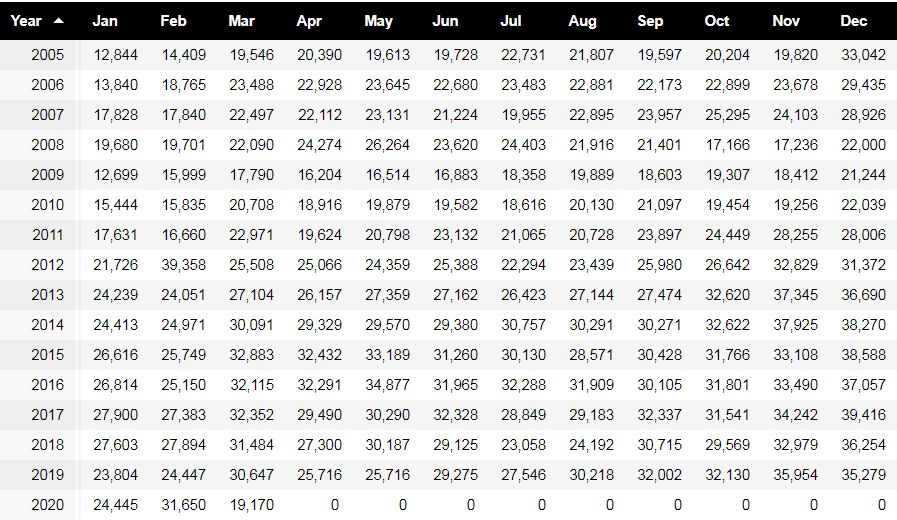
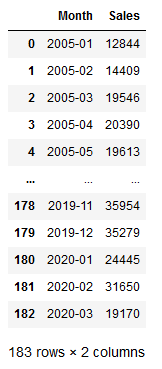
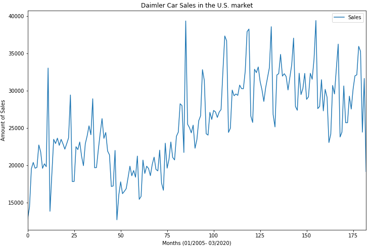
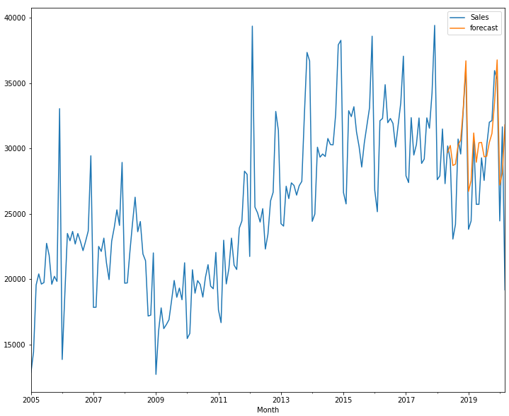
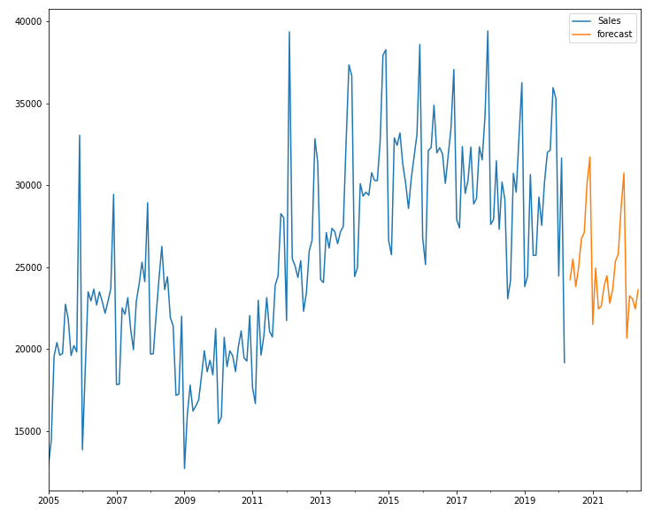

# Time-Series-Project--Daimler-Car-Sales-Prediction

+ [Table of Contents](#sub-sub-heading-1)
    + [Credits](#credits)
    + [Project Goal and procedure](#project-goal-and-procedure)
    + [Code and Resources](#code-and-resources)
    + [Part 1- Scraping Data with BeautifulSoup](#part-1--Scraping-data-with-beautifulsoup)
    + [Part 2- Building the model](#part-2--Building-the-model)
    + [Part 3- Model Limitations and Conclusion](#part-3--model-limitations-and-conclusion)
    

    
    
### Credits: 
A big thank you goes to [KenJee](https://www.youtube.com/channel/UCiT9RITQ9PW6BhXK0y2jaeg), [Codebasics](https://www.youtube.com/channel/UCh9nVJoWXmFb7sLApWGcLPQ), [Krish Naik](https://www.youtube.com/user/krishnaik06), [Keith Galli](https://www.youtube.com/channel/UCq6XkhO5SZ66N04IcPbqNcw)  and to the whole [Edureka Team](https://www.youtube.com/user/edurekaIN) who put a lot of effort to teach people Data Science, Machine Learning, Statistics and a lot of other related topics for free.

### Project Goal and procedure: 
* Goal: Predict/Forecast future car sales for Daimler in the U.S. market
* Scraped previous sales data from [Goodcarbadcar.com](https://www.goodcarbadcar.net/daimler-ag-us-sales-figures/) using Python and BeautifulSoup
* Availabe data: From January, 2005- March, 2020 (183 months)
* Time Series: The Time Series method is a sequence of observations which is recorded at regular time intervals. This is the initial step before we can forecast future sales.

### Code and Resources
* Python Version: 3.8
* Environment: Jupyter Notebook
* Packages: BeautifulSoup, Matplotlib, Numpy, Statsmodels

## Part 1- Scraping Data with BeautifulSoup
The be able to develop a forecast, we need to take a look on the previous data. Therefore, the following table which contains sales information from January 2005- March 2020, will be scraped:

After saving the necessary data, I saved it in a csv file and opened it by using the Python's pandas package:

Visualization of the scraped data in a graph: 

## Part 2- Building the model

When you build a time series model it is important to check the data for stationarity. In statistics, stationarity means that the mean and the standard deviation are constant and that there is no seasonality. 

To check if our time series is stationary or non- stationary, we can use the "Augmented Dickey-Fuller Test" which is a widely used test to approach this use case. 
Next, we make 2 hypothesis:

Null Hypothesis(H0): Our data is not stationary
Alternate Hypothesis(H1): Out data is stationary

To check which hypothesis is present in our use case we take on look on the p-value

p-value < 0.05: We reject the Null Hypothesis. The data is stationary
p-value > 0.05: We accept the Null Hypothesis. The data is not stationary.

By using the "adfuller package" from "Statsmodels", we get a p-value of 0.64. That means that we accpept the H0- Hypothesis. Hence, the data is not stationary. 

In the next step, we have to make the data stationary. 

In order to proceed and being able to forecast the sales for the future, it is necessary to transform the data with the goal to make it stationary.   

One of the common methods to make that happen is to take the difference between an existing value and the previous one. Another transformation methods are taking the logs, the square root or the proportional change. But in our case, taking the difference seems to be enough to be able to proceed. After completing this step, we apply again the "Augmented Dickey-Fuller Test" and get a p value of 0.008 which is smaller than 0.05. That means that after the transformation step we have stationary data and can reject the H0- Hypothesis!

In the future forecasting, both methods, "ARIMA" and "SARIMAX" are used in time series. Since out graph shows some kind of seasonality, we will use the "SARIMAX" approach since the "ARIMA"- method can just be applied if it is sure that no seasonal tendencies exist. 

In the last two steps of this project I will implement a forecast model, using the "SARIMAX" method. 
The following graph shows the actual and the predicted sales information of the previous 24 months: 

Even if the orange line does not lie exactly on the blue line and deviations can be observed, it can be said that the overall correlation between the actual and the predicted values exists. 

Finally, we can try to predict the sales of the next 24 months:

## Part 3- Model Limitations and Conclusion
In Summary, I scraped the car sales data of Dailmer from the last 15 years with BeautifulSoup. Afterwards the data was visualized and based on the trends of previous data I tried to predict the future sales, using the "SARIMAX" approach. Nevetheless, this is just a simple statistical model and can for sure not predict the future sales in real life since we all know that previous trends do not guarantee that that trend will be the same in the future, otherwise everyone would be successful for example in the stock market. 
